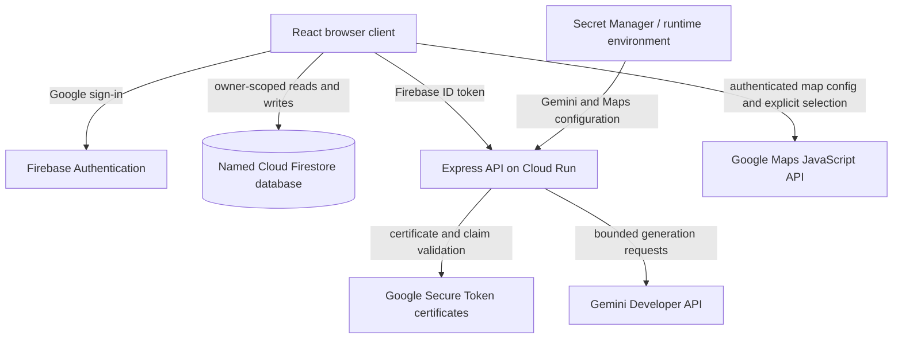

# Reflective Architecture Context

> Architecture snapshot date: 2026-09-06（Asia/Taipei）
> Audience: collaborators reviewing or changing the repository. Read `PROJECT_STATE.md` first for live status and current next actions.

## 1. Product boundary

Reflective is an authenticated journaling and emotional-reflection application. It combines a React client、Firebase Authentication、owner-isolated Cloud Firestore storage、an Express API on Cloud Run and Gemini generation。

The product supports reflection and help-seeking。It is not a therapist、medical device、diagnostic system、emergency service or substitute for professional care。

Core privacy boundary：journal text is sent to Gemini only when the user requests a chat or summary response。Pinned coordinates are stored in Firestore after explicit consent but are never included in Gemini payloads。

## 2. Runtime architecture



### Journal request sequence

```mermaid
sequenceDiagram
  participant U as User
  participant UI as JournalEditor
  participant DB as Firestore
  participant API as Cloud Run API
  participant AI as Gemini

  U->>UI: Submit reflection
  UI->>DB: Persist user message
  alt save failed
    DB-->>UI: Failure
    UI-->>U: Safe persistence error; stop
  else save passed
    DB-->>UI: Success
    UI->>API: Authenticated bounded transcript
    API->>AI: Generate reflection
    AI-->>API: Text + actual model
    API-->>UI: Safe response
    UI->>DB: Persist Gemini message
    alt final save failed
      UI-->>U: Do not claim success
    else final save passed
      UI-->>U: Render persisted response
    end
  end
```

The first Firestore write is a deliberate cost and integrity boundary。Gemini must not run when the user's message has not persisted。

## 3. Source map and ownership

| Path | Responsibility | Important boundary |
|---|---|---|
| `server.ts` | Express app、headers、authentication、rate limits、Gemini chat／summary、Maps config and optional admin／notification routes | All protected API routes verify Firebase ID tokens before privileged work |
| `server/firebaseAdmin.ts` | Server-side Firebase Admin initialization and named Firestore access | Uses runtime identity／project configuration，never browser credentials |
| `server/rbac.ts` | Role parsing and privileged-change policy | Candidate code；does not prove Production bootstrap or role mutation |
| `server/notifications.ts` | Minimal external notification payloads and delivery adapters | Candidate code；must never receive journal content |
| `server/crisisResources.ts` | Deterministic regional crisis-support content | Runs without Gemini and never auto-contacts anyone |
| `src/App.tsx` | Authentication state、journal subscription and save／delete orchestration | `handleUpdateEntry` reports persistence success／failure |
| `src/components/JournalEditor.tsx` | Conversation、summary、location controls、error states and Markdown export | Calls Gemini only after user-message persistence succeeds |
| `src/components/Sidebar.tsx` | Journal list、search、account surface and responsive navigation | Keep short-height landscape history usable |
| `src/components/LandingPage.tsx` | Signed-out product and authentication surface | Must not expose journal UI before auth |
| `src/components/LocationPicker.tsx` | Lazy map load、explicit coordinate selection and label input | Never request device geolocation |
| `src/components/LanguageSelector.tsx` | Static UI locale control | Locale is presentation state，not Gemini instruction |
| `src/components/SafetySettings.tsx` | Explicit safety-resource region preference | Never infer region from GPS、journal location or Gemini |
| `src/components/AdminDashboard.tsx` | Repository candidate admin surface | Not a verified Production capability |
| `src/components/NotificationSettings.tsx` | Default-off preference UI | Production delivery not verified |
| `src/lib/firebase.ts` | Firebase client、App Check、auth and owner-scoped Firestore helpers | Uses named database and strips undefined values before writes |
| `src/lib/api.ts` | Authenticated typed API calls | Adds ID token；never logs or persists it |
| `src/lib/googleMaps.ts` | Maps script loader | No forced `language`／`region`; browser／Maps defaults apply |
| `src/lib/location.ts` | Coordinate normalization and Google Maps URL construction | Bounds coordinates and label |
| `src/i18n/` | Bundled `en`／`zh-TW` dictionaries and locale context | No runtime translation API |
| `src/types.ts` | Shared browser data contracts | Keep Rules and persisted schema aligned |
| `firestore.rules` | Client authorization and stored-shape validation | Owner-only entries／preferences；server collections deny client access |
| `firebase.json` | Named-database Rules deployment and local Emulator configuration | Changing database ID changes deployment target |
| `firebase-applet-config.json` | Public Firebase Web configuration and App Check site identifier | Not a location for Gemini／server secrets |
| `.env.example` | Placeholder-only runtime configuration map | Never replace placeholders with live values in Git |
| `tests/` | Rules、location、RBAC、notification and crisis-resource regression suites | Rules tests use a synthetic local project |

## 4. Data model

### JournalEntry

```text
/users/{uid}/entries/{entryId}
```

Required fields：

- `id`、`userId`
- `title`
- `createdAt`、`updatedAt`
- `tags`
- `messages`
- `wordCount`

Optional fields：

- `mood`
- `latestSummary`
- `keyTakeaways`
- `location: { latitude, longitude, label? } | null`

Messages contain `id`、`role`、`content`、`timestamp` and optional `mode`／`modelUsed`。Rules cap stored messages at 20 and validate append／rolling transitions rather than re-evaluating arbitrary rewritten history。

### Preferences

```text
/users/{uid}/preferences/notifications
/users/{uid}/preferences/safety
```

- Notification preferences are default off and bounded to known event types。
- Safety preference stores only a supported region code and update timestamp。

### Server-only collections

```text
/_adminAudit/{auditId}
/_notificationEvents/{eventId}
```

Firestore Rules deny all browser reads and writes。Only server-side Admin SDK candidate paths may access them when deployed and authorized。

## 5. API contracts

All `/api/*` routes except implementation-level static handling pass through pre-authentication limiting and Firebase authentication。Responses use `Cache-Control: no-store`。

| Route | Purpose | Key constraints |
|---|---|---|
| `GET /api/health` | Runtime health | Does not expose secret or dependency details |
| `POST /api/chat` | Multi-turn reflection | 1–20 messages、16,000 total characters、known modes、deterministic crisis precheck |
| `POST /api/summarize` | Structured summary and takeaways | Bounded transcript、defensive JSON handling、deterministic crisis precheck |
| `GET /api/maps-config` | Authenticated Maps browser configuration | Separate limiter、fails closed when missing、no-store |
| `GET /api/me/access` | Current role metadata | Authenticated；role claims do not self-authorize mutation |
| `/api/admin/*` | Repository candidate privileged operations | Requires admin or allowlisted owner；not Production-verified |
| `POST /api/notifications/dispatch` | Repository candidate generic notification | Default-off preference and minimal event payload；not Production-verified |

Chat request data is limited to messages、mode、title、tags、mood and explicitly selected safety-resource region。Summary request data is limited to transcript、title and safety-resource region。Neither request includes stored coordinates or UI locale。

## 6. Runtime configuration

### Required for core application

| Variable／file | Consumer | Handling |
|---|---|---|
| `GEMINI_API_KEY` | `server.ts` | Server-side Secret Manager／environment only |
| `FIREBASE_PROJECT_ID` or `GOOGLE_CLOUD_PROJECT` | API token verification and Admin SDK | Must match token issuer／audience and intended project |
| `firebase-applet-config.json` | Browser Firebase SDK | Public client configuration；protect data with Rules、API restrictions and App Check |
| `firestoreDatabaseId` | Browser Firestore client | Must match the intended named database |
| `APP_URL` | Notification links and deployment metadata | Public application URL |

### Optional capabilities

| Variable | Capability | Boundary |
|---|---|---|
| `GOOGLE_MAPS_API_KEY` | Browser Maps picker | Use a dedicated website/API-restricted browser key |
| `GOOGLE_MAPS_MAP_ID` | Vector map rendering | Not a secret，but configure with the matching project |
| `OWNER_UIDS` and role-operation variables | RBAC candidate | Server-only；manual bootstrap and Production verification required |
| Slack／Discord／Gmail variables | Notification candidate | Server-only secrets；never store in Firestore or client code |
| `FIRESTORE_DATABASE_ID` | Server-only audit／delivery candidate | Must match the intended named database |

Production and AI Studio Preview have different origins。Do not broaden the Production Maps or reCAPTCHA key simply to accommodate a transient Preview hostname；use a separately restricted Preview key where necessary。

## 7. Safety-critical invariants

Changes must preserve all of the following unless the user explicitly authorizes a security redesign and matching validation：

1. Gemini and summary routes authenticate before model use。
2. Firebase ID tokens、server API keys、OAuth secrets and webhooks never enter logs、Firestore journal documents or client-visible errors。
3. Firestore user paths remain owner-bound and server-only collections remain inaccessible to clients。
4. User message persistence completes before Gemini generation begins。
5. A failed final Firestore write is not represented as a successful persisted response。
6. Message count、message size and total transcript bounds remain enforced on both client and server paths。
7. Crisis escalation remains deterministic and runs before Gemini；the app never diagnoses or auto-contacts anyone。
8. Location remains explicit-consent only，never device geolocation，and never enters Gemini payloads。
9. UI locale remains local presentation state and does not force Gemini response language。
10. App Check enforcement is not enabled solely to silence Preview warnings；use real-browser evidence first。
11. RBAC and external notifications remain labeled repository candidates until deployed and runtime-tested。
12. The primary public model claim remains truthful to returned `modelUsed` evidence。

## 8. Deployment boundaries

### Verified Production

- Firebase Authentication and owner-isolated Firestore journal storage。
- Cloud Run authenticated Gemini chat and summary flow。
- First-message and generated-message persistence。
- English／Traditional Chinese static UI。
- Consent-based Maps location lifecycle。
- Markdown export and deterministic safety response。
- App Check client initialization；enforcement remains off。

The final user-operated submission smoke test reconfirmed public page load、demo-account authentication、synthetic first-message save、English Gemini response、reload persistence and the full explicit Maps pin／save／reload／open／remove lifecycle。No automatic device-location request、Firestore permission error or Maps／API error appeared。

### Repository-only candidates

- Privileged RBAC bootstrap／mutation and admin dashboard runtime。
- Gmail、Slack and Discord notification delivery。
- Any associated audit／delivery records beyond local test coverage。

### Deferred product work

- Voice input／output。
- Additional UI locales。
- Shared multi-instance rate-limit storage。
- Formal retention、account erasure、incident response and clinical governance policies。

## 9. Verification map

| Change area | Minimum verification |
|---|---|
| TypeScript／React | `pnpm run lint` and `pnpm run build` |
| Chat／summary boundary | Local auth negative paths plus one user-operated Preview smoke when deployed |
| Firestore schema／rules | `pnpm run test:rules` with Java and synthetic Emulator project |
| Location | `pnpm run test:location` plus explicit Preview lifecycle when deployed |
| RBAC／notifications／safety resources | `pnpm run test:security` and separate runtime proof before any Production claim |
| Documentation only | Link／path validation、status consistency、secret scan and `git diff --check`; application tests only as a baseline confirmation |
| Cloud configuration | Read-only inspection first；explicit user approval before mutation；signed-out／authenticated smoke after propagation |

Never use real journal content in tests or recordings。Do not copy request `Authorization` headers into chat or documentation。

## 10. Collaboration workflow

1. Read `PROJECT_STATE.md` and verify the current Git branch／cleanliness。
2. Classify the task as read-only、local code／docs、deployment or cloud mutation。
3. Keep user-operated browser／cloud steps manual when requested。
4. Make the smallest coherent change and preserve unrelated user work。
5. Run tests proportional to the affected boundary。
6. At milestone completion，update only the documents required by the recording standard。
7. Use a feature／fix／docs branch and PR；do not merge `main` without explicit authorization。

## 11. Documentation ownership

- `README.md`：public product entry and reproduction guide。
- `development-change-log.md`：feature、code、test、deployment and tooling chronology。
- `security-remediation-log.md`：security finding register、remediation evidence and residual risk。
- `PROJECT_STATE.md`：current handoff state and next actions。
- `CONTEXT.md`：this architecture map and invariant set。
- Git commits／PR：source-level timeline and review record。

Do not append dated work logs to this file。Update the snapshot date only when architecture、file ownership、data flow or a safety-critical invariant changes。
