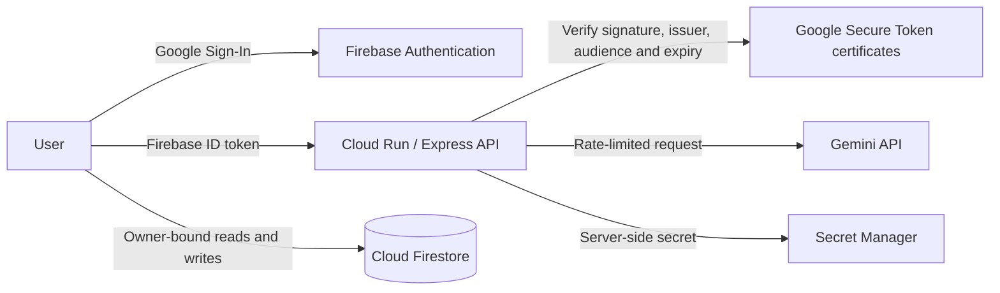

# Reflective — Gemini Journal Companion

Reflective is a private journaling companion that helps people slow down, put difficult thoughts into words, and explore them with Gemini.

I started this project for the **Gen AI Academy APAC Ideathon**. My background is in clinical care, so I wanted to build something more thoughtful than a generic chatbot: a calm place for reflection that also treats authentication, personal data, API cost, and crisis language as real product responsibilities.

> Reflective supports journaling and help-seeking. It is not a therapist, medical device, emergency service, or substitute for professional care.

## What the app can do

- Sign in with Google through Firebase Authentication.
- Keep each person's journal entries in a user-isolated Firestore path.
- Hold multi-turn conversations with Gemini.
- Switch between reflective questions, summaries, brainstorming, action steps, and mindful grounding.
- Add moods and tags, search previous entries, and export a journal as Markdown.
- Show a deterministic crisis-support message before calling Gemini when high-risk self-harm language is detected.

## How it works



The browser talks directly to Firestore for journal storage, but every document lives under:

```text
/users/{firebaseUid}/entries/{entryId}
```

Firestore Security Rules require the authenticated UID to match the path. The Gemini key never goes to the browser; Cloud Run receives it as a server-side secret.

## Security work

The first version looked protected because the dashboard required sign-in, but a security review found that the public Cloud Run API itself did not verify the signed-in user. That meant someone could bypass the interface and call Gemini at my expense.

I fixed the underlying boundary instead of relying on the UI:

- The frontend now sends a Firebase ID token in the `Authorization: Bearer` header.
- The backend verifies the token's RS256 signature, key ID, issuer, audience, expiry, issue time, and user ID.
- Gemini routes reject unauthenticated requests before any model call is made.
- Per-IP and per-user limits reduce automated abuse and accidental cost spikes.
- Request bodies, message history, titles, tags, and model output have explicit size limits.
- The fallback ladder only retries temporary errors such as `429` and `5xx`; invalid or unauthorized requests are not multiplied across models.
- Provider and billing details stay in server logs instead of being returned to the browser.
- Firestore rules validate required fields, allowed fields, types, ownership, and immutable IDs.
- A domain-restricted reCAPTCHA Enterprise key is registered with Firebase App Check. The App Check-enabled frontend was successfully republished and verified on the public site. Enforcement stays off while I monitor legitimate traffic.
- Basic security headers disable framing, MIME sniffing, and unused browser permissions.

### Cost controls

The backend currently allows up to **20 Gemini requests per authenticated user per hour**, with an additional pre-authentication IP limit. Conversations sent to Gemini contain at most **20 messages** and **16,000 characters**.

These limits are intentionally conservative for an Ideathon prototype. The limiter is in memory, so a larger multi-instance deployment should move this state to a shared store such as Memorystore and add Cloud Armor controls.

## Crisis-safety behavior

If the newest entry contains clear self-harm or suicide language, the API does not ask Gemini to improvise. It returns a fixed support message that encourages immediate human help and includes Taiwan resources:

- Emergency services: **110 / 119**
- MOHW 24-hour Lifeline: **1925**
- LifeLine Taiwan: **1995**
- Teacher Chang: **1980**

This is a safety net, not a clinical risk assessment. False positives and missed phrasing are possible, which is why the app does not diagnose, score risk, or promise that an automated check can prevent harm.

## Tech stack

- React 19, TypeScript, and Vite
- Express on Google Cloud Run
- Gemini API through `@google/genai`
- Firebase Authentication
- Cloud Firestore with owner-bound rules
- Google Cloud Secret Manager
- Firebase App Check with reCAPTCHA Enterprise

## Run locally

### 1. Install dependencies

```bash
bun install
```

### 2. Configure local environment variables

Copy `.env.example` to `.env.local` and provide your own development values:

```dotenv
GEMINI_API_KEY=your_local_development_key
FIREBASE_PROJECT_ID=your_firebase_project_id
APP_URL=http://localhost:3000
```

Never commit the populated environment file. Production secrets should be supplied by Secret Manager rather than stored in source control.

### 3. Start the app

```bash
bun run dev
```

The app runs on `http://localhost:3000`.

## Verification checklist

- [x] Landing page builds and loads without a signed-in session.
- [x] Gemini key is absent from client code and committed environment files.
- [x] Frontend includes a Firebase ID token for Gemini API requests.
- [x] Backend rejects missing and structurally parseable invalid tokens before Gemini use.
- [x] Map unparseable JWT and signature-verification exceptions to fixed `401 INVALID_TOKEN` in the unpublished AI Studio source.
- [x] Re-export and independently verify malformed-token responses against the new production bundle.
- [x] User and IP rate limits are applied before Gemini generation.
- [x] Model fallback skips non-retryable errors.
- [x] Firestore rule source enforces owner paths and validates entry shape.
- [x] Crisis language uses a deterministic response instead of a generated answer.
- [x] Production build starts successfully in the AI Studio preview environment.
- [x] Deploy the hardened Firestore rules to the AI Studio Firestore database.
- [x] Register a domain-restricted reCAPTCHA Enterprise key in Firebase.
- [x] Republish the App Check-enabled frontend and verify that the public bundle loads reCAPTCHA Enterprise.
- [x] Add and pass Firestore emulator tests for the hardened rules.
- [x] Publish the hardened Cloud Run revision and complete a user-reported authenticated public-app smoke test.
- [x] Validate normal summary generation, reload persistence, and Markdown summary/takeaway export in the signed-in AI Studio Preview.
- [x] Validate long-transcript crisis escalation and UI duplicate-request protection in the signed-in AI Studio Preview.
- [x] Validate the offline user-facing allowlisted error state without losing the existing summary.
- [ ] Validate the expired-session allowlisted error state.
- [x] Validate sign-out UI access boundaries and same-account data restoration after re-authentication.
- [x] Validate two-way cross-account journal isolation with two controlled Preview accounts.
- [x] Export the latest AI Studio candidate and locally pass TypeScript, production build, dependency audit, source secret scan, and unauthenticated backend smoke checks.
- [x] Remediate and code-review nested Firestore entry validation and raw/persisted general-chat error handling.
- [x] Manually verify general-chat failure/retry behavior, error redaction, non-persistence, and retry without duplication.
- [x] Independently validate the new Rules with the local Emulator suite.
- [ ] Deploy the independently tested transition-validation Rules revision after explicit approval.

Firestore Emulator test implementation began on 2026-09-04 against the latest verified responsive-remediation export. At kickoff, the nested-validation Rules were treated as reviewed source rather than independently validated or deployment-ready behavior; the final result is recorded below.

Initial local setup inspection found Node.js and `pnpm`, but not Java, Firebase CLI, or `@firebase/rules-unit-testing`. The test runner will use a synthetic `demo-*` project ID and the local Rules testing SDK so it cannot reach the production Firestore database.

The missing prerequisites are now staged locally: Firebase CLI `15.28.2`, Rules testing library `5.0.2`, verified portable Microsoft OpenJDK `21.0.12.1`, and Firestore Emulator `v1.22.0`. The first launch stopped before Rules evaluation because the CLI attempted to read a sandbox-blocked user config path; the retry uses an ignored project-local config directory.

The redirected retry proved the Emulator and demo-project isolation start correctly, but `tsx` failed before assertions on a sandbox-specific Windows user-info call. Rules tests now use the Node 24 built-in TypeScript test runner to remove that runtime layer.

The first completed Emulator matrix ran 15 tests: 14 passed and 1 exposed a deployment blocker. A valid entry at the documented 20-message boundary exceeded Firestore Rules' 1,000-expression evaluation limit. Capacity probing showed that the full-array strategy passed at four messages and failed at six, so micro-optimization was not a safe path to the documented limit.

The remediation validates message transitions instead of re-evaluating the entire stored history on every write. New entries may start with zero to two fully validated messages. Updates may keep the message list unchanged, append one fully validated message, or roll a full 20-message window forward by dropping the oldest message and appending one validated message. Bulk history replacement, shortening, invalid appended messages, and a 21st stored message are denied. `JournalEditor.tsx` now also bounds the persisted Gemini reply to `MAX_STORED_MESSAGES`, closing the matching 21-message off-by-one case.

The final local suite passes all 21 tests. TypeScript, frontend and server production builds, the production dependency audit, and source-only secret scanning also passed. This revision is independently validated locally but remains unpublished and undeployed.

## Development status and change records

This Ideathon emphasizes the product idea and accepts vibe coding, so I use Google AI Studio as an active implementation partner. I still treat every generated change as engineering work: I review the affected files, verify the deployed behavior, and record what was confirmed separately from what remains planned.

Current and future milestones are summarized in this README. Detailed security work is recorded in `outputs/security-remediation-log.md`, while code, UI, and AI Studio implementation changes are recorded chronologically in `outputs/development-change-log.md`. `PROJECT_STATE.md` remains the handoff snapshot for continuing the project in a new session.

The current local engineering baseline is `work/reflective-gemini-journal-post-responsive-remediation-2026-09-04/`. The shorter `work/reflective-gemini-journal/` path is a preserved historical snapshot and must not be treated as the latest candidate.

### Implementation status — 2026-09-03

The backend reflection-summary slice is complete in the **AI Studio source only**. The authenticated `POST /api/summarize` route now requests structured JSON and defensively returns a concise `summary` plus 3–5 bounded `keyTakeaways`. AI Studio reported a clean TypeScript check and production build for that checkpoint.

A second AI Studio checkpoint adds the frontend summary action, authenticated request, defensive response handling, persistence through `onUpdateEntry`, a Natural Tones Insights card, accessible status banners, crisis-display separation, and Markdown export. Initial review found that its transcript truncation could discard the newest message and that its generic catch path could surface raw Firebase SDK wording.

A third focused checkpoint remediates both findings. Transcript construction now guarantees the newest user message, fills the remaining 16,000-character budget from newest to oldest, preserves message boundaries, and restores chronological display order without a final prefix slice. Summary failures now use a fixed allowlist of safe UI messages and static browser logging. The actual diff was reviewed, and AI Studio reported a zero-error TypeScript check and successful production build.

All three reflection-summary checkpoints remain **unpublished**. The earlier candidate remains at `work/reflective-gemini-journal-export-2026-09-03/`, while the prior `work/reflective-gemini-journal/` copy is also preserved. A newer post-chat-remediation export is staged separately. Signed-in Preview QA passed normal summary, persistence, Markdown export, long-transcript crisis handling, duplicate-request protection, offline handling, sign-out, and two-account isolation.

Final publication is still blocked. The nested-validation Rules now have a 21-test local Emulator pass after remediating the expression-limit defect, and the matching frontend 20-message off-by-one is fixed locally. These changes have not been deployed. Expired valid-token UI behavior, deployment of the tested Rules revision, and post-publish regression testing remain pending.

### Planned multilingual and voice milestone — cost-gated

The next requested product milestone adds a whole-UI language selector, multilingual voice input, and multilingual voice playback. Development and testing have a strict user-defined ceiling: total Google Cloud Platform and API spending must not exceed `NT$400` of prepaid funds.

The recommended first implementation adds no new metered Google Cloud speech or translation service. It will use bundled UI locale files, BCP-47 language tags, browser-provided speech recognition when available, and browser/operating-system speech synthesis voices. The UI locale must not be sent to Gemini; Gemini response language remains driven naturally by the user's journal input.

“All official national languages” is treated as a broad language-selection and graceful-fallback goal, not a guarantee that every browser and operating system provides recognition and synthesis for every locale. Unsupported recognition must fall back to text input; unavailable voices must leave readable text intact. No Cloud Translation, Speech-to-Text, Text-to-Speech API, new paid service, billing change, or production usage test may be enabled without a separate cost review and explicit approval.

Development tests should be local or mocked by default, keep a ledger of any real Gemini requests, avoid bulk multilingual API calls, and stop if current billing cannot be verified within the `NT$400` ceiling. A normal Cloud Billing alert is monitoring rather than a guaranteed hard cap.

#### Adopted first slice

The approved first slice is UI localization only. It will completely localize the static interface into `zh-TW` and `en`, add a language selector on both signed-out and signed-in surfaces, detect the browser language on first use, and persist the preference only in `localStorage`. Translation dictionaries will ship with the frontend and require no runtime Cloud Translation call. Journal content, Gemini responses, and the backend crisis response are user/content data rather than interface copy and will not be automatically translated in this slice.

This slice must add no Firestore document, field, listener, read, or write; no backend/API route; no dependency; and no Cloud configuration. Its direct incremental API cost is expected to be approximately `NT$0/month`, aside from negligible static frontend asset transfer already covered by the existing hosting path. Voice input/output remains deferred.

Cost clarification: with this browser-first design, the three features add no Cloud Translation, Cloud Speech-to-Text, Cloud Text-to-Speech, or Firestore call of their own. Locale preference stays in per-browser `localStorage`; speech interim results stay in React state; speech playback reads the response already on screen. Sending a completed voice transcript uses the same existing journal-save and Gemini-request flow as typed text. The selected-locale instruction adds only a small number of input tokens to the existing Gemini request, not a second request.

The configured named Firestore database `ai-studio-d82d6296-0049-4433-955f-91f203831d05` is the current journal store for `/users/{uid}/entries/{entryId}` documents, including titles, tags, moods, messages, summaries, and takeaways. It is not required for language selection or speech. `localStorage` is available independently on every user's device, but the preference is browser/profile/origin-specific and therefore does not automatically follow the same user to another device. The hosted app does not require the developer's computer to remain powered on.

#### UI localization checkpoint and QA — 2026-09-03

Google AI Studio created an unpublished frontend-only checkpoint touching nine files under `src/`: typed locale definitions, bundled `en` and `zh-TW` dictionaries, `LanguageContext`, a reusable `LanguageSelector`, and integrations in `LandingPage`, `Sidebar`, `App`, and `JournalEditor`. AI Studio reported a successful build. No backend, Firestore Rules, Firebase configuration, package, lockfile, deployment, or publication change was reported.

Direct source inspection confirmed that the `/api/chat` payload remains `{ messages, mode, title, tags, mood }` and the `/api/summarize` payload remains `{ text, title }`. Neither payload contains the selected locale or a language instruction, and no Gemini response translation or post-processing was added. The existing behavior—Gemini responds naturally according to the user's reflection language—therefore remains structurally preserved.

Direct Preview QA passed the signed-in language selector, English-to-Traditional-Chinese switching, translated static controls and accessibility labels, localized dates/times, and persistence after Preview reload. Existing English journal text and Gemini output remained in English while the surrounding UI was Traditional Chinese, confirming that content was not automatically translated. This QA made zero Gemini requests and added no Firestore document operation specifically for language selection.

The initial `1 error running the code` indicator was traced to transient Preview infrastructure: App Check reCAPTCHA failure on the temporary `run.app` origin, a temporary Firestore connection failure, and a Vite WebSocket disconnect. The app still rendered. After reloading Preview, the error indicator cleared and only the known App Check warning remained; do not use AI Studio's automatic `Fix` for this condition.

Signed-out Preview QA subsequently passed selector availability, both locale choices, English and Traditional-Chinese landing copy, reload persistence, keyboard opening/selection, and absence of a keyboard trap. A focused wrapper-level indicator remediation was then manually retested: both Landing and Sidebar selectors now show a visible keyboard-focus indicator, Space or Alt+Down opens the selector, arrow keys plus Enter work, mouse selection remains functional, and no error or keyboard trap appeared. This is a user-reported Preview pass; the exact one-file source diff remains pending the next export review.

Pending before publication: verify first-use browser-language fallback, blocked-`localStorage` fallback, responsive layout, both cross-language Gemini cases, localized Markdown output in Preview, and the exported focus-remediation source diff.

Responsive Preview QA on 2026-09-04 passed desktop, English desktop, phone portrait, sidebar toggling, and language-selector operation at every tested size. It found two blockers: Phone landscape and both Tablet orientations allow the AI Lens controls to overlap the entry-list/sidebar region, and the fixed expanded composer consumes roughly half of a landscape phone viewport and about two-thirds of portrait height with no collapse control. The next focused UI checkpoint should keep the composer expanded by default but provide an accessible localized collapse/expand action, preserve drafted text while collapsed, and keep tablet widths on the overlay-sidebar behavior rather than the static desktop layout.

Follow-up Preview QA confirmed that the localized composer collapse/expand control works and that the draft remains usable. The sidebar breakpoint change also removed the original broad AI Lens/sidebar collision. One non-blocking visual defect remains: in Tablet portrait and Mobile landscape, the masked Firestore path badge (`/users/{uid}/entries`) slightly overlaps the `Reflective` mood control in the editor header. Both controls remain operable. The next checkpoint is limited to responsive header wrapping/stacking in `JournalEditor.tsx`; it must not change Gemini payloads, stored content, Firestore operations, composer behavior, or sidebar behavior. This result is user-reported from AI Studio Preview, and the five-file source checkpoint still requires verification from a fresh export.

An additional follow-up found that the AI Lens option strip overlaps the composer collapse control at every tested viewport: Mobile portrait/landscape, Tablet portrait/landscape, and desktop. The required interaction is a dedicated horizontal-scroll option region with the collapse control outside that scroll region. Desktop must expose a usable horizontal scrollbar; touch devices must allow direct swipe/pan anywhere over the AI Lens option region rather than requiring contact with the scrollbar. This remains a frontend-only layout correction with no Gemini or Firestore cost.

The combined editor-header and AI Lens/collapse-control corrections subsequently passed user Preview testing. A live follow-up inspection found one Mobile-landscape-only Sidebar issue: the conversation-history list scrolls correctly, but its viewport is reduced to a very narrow strip between the upper navigation/search controls and the lower language/sync/account controls. The next isolated checkpoint should optimize `Sidebar.tsx` for short landscape viewports, preserve all controls, and allocate a materially larger portion of the Sidebar height to the history list. No Gemini request is needed for this layout test.

The first Sidebar remediation attempt did not change the live Mobile-landscape result. Inspection of the AI Studio checkpoint and its diff found that the run ended as `Canceled` and used classes such as `landscape:max-h-[500px]:p-2`. In Tailwind, `max-h-[500px]` is a max-height utility rather than a viewport-height variant, so this stacked candidate does not implement the intended media query and can be omitted from generated CSS without failing the build. The checkpoint summary's claimed `~184 px` history viewport and two-visible-entry result are therefore unverified and contradicted by the live Preview. Replace these candidates with a supported condition such as `landscape:max-lg:*`, or a verified arbitrary media variant, then retest the actual Preview.

The corrective AI Studio Code edit is now saved and has passed user-operated Preview verification. The edit was isolated to `src/components/Sidebar.tsx`: all 70 invalid `landscape:max-h-[500px]:` prefixes were mechanically replaced with the supported `landscape:max-lg:` responsive prefix, without changing the file's line count or sending a Gemini prompt. The first snapshot-save attempt failed; AI Studio then presented a conflict view, where the corrected source was retained. A separate 26-file history comparison represented the initial snapshot versus the current project and was not the scope of this edit. In Mobile landscape Preview, the user confirmed that the previously cramped conversation-history viewport is fixed. No publish, deployment, Firestore write, or application Gemini request was performed.

The fresh checkpoint `reflective-gemini-journal-post-responsive-remediation-2026-09-04.zip` was subsequently downloaded and independently inspected. Its SHA-256 is `F3552FBE2C2F2B6699CBC45D8C6B7A68D5B2F048DA61D52533EB40498F55E18E`. Exported `Sidebar.tsx` contains zero invalid prefixes and 70 supported `landscape:max-lg:` prefixes; the production CSS contains the corresponding landscape and below-`lg` media rules. TypeScript passed with zero errors, the Vite plus server esbuild production build passed, and the production dependency audit reported no known vulnerabilities. The build retains a non-blocking large-chunk warning (`1,216.95 kB`, gzip `334.38 kB`). Secret scanning found no private key or real Gemini server key; the only Google key is the intentionally client-visible Firebase Web configuration key, and the documented Gemini value is a placeholder. Relative to the preceding export-label v2 checkpoint, seven source/lock files differ: `bun.lock`, `JournalEditor.tsx`, `LanguageSelector.tsx`, `Sidebar.tsx`, both locale dictionaries, and the typed i18n dictionary. Backend, Firestore Rules, Firebase configuration, and `package.json` are unchanged.

A focused four-file checkpoint resolved the Markdown export-label finding. The typed dictionaries now include `exportUserHeading`, `exportAiHeading`, `exportFallbackModel`, and `exportNotAvailable`; `handleExportEntry()` uses those keys while preserving journal titles, tags, moods, user messages, Gemini responses, summaries, and takeaways verbatim. The exported ZIP was independently inspected at `work/reflective-gemini-journal-post-export-label-i18n-v2-2026-09-03/` with SHA-256 `AA95348AEE9D83191758D8867C0E5BCEB530383D0B8F5752D8955342DA0DCD60`. Source scope matched the four reported files, while `bun.lock` was empty in the export artifact; `package.json`, backend, Rules, and Firebase configuration remained byte-identical. AI Studio reported zero TypeScript errors and a successful build. A separate local build attempt remains unclaimed because the local dependency-link verification harness hit a filesystem access restriction, not a reported source compilation error.

## Known limitations

Reflective is an Ideathon prototype, not a clinical system. Journal text is protected by Firebase access controls and Google Cloud encryption at rest, but it is not end-to-end encrypted. A project administrator with sufficient cloud permissions may still access stored data.

The keyword-based crisis safeguard is deliberately simple. A production mental-health product would need clinical governance, localized safety content, privacy and retention policies, abuse monitoring, accessibility testing, evaluation with qualified professionals, and clear incident-response ownership.

The domain-restricted App Check key is configured for the published app domain. AI Studio's transient Preview origin therefore logs reCAPTCHA/App Check token warnings; enforcement remains off, so Preview QA can continue. Do not use those Preview warnings as evidence of a public-app failure or click AI Studio's automatic `Fix` for network errors intentionally created during offline testing.

## Project context and attribution

Built for the **Gen AI Academy APAC Edition — Personal Gemini Journal Ideathon Challenge**.

The project began with Google's [Cloud Run AI Challenge codelab](https://codelabs.developers.google.com/codelabs/cloud-run/cloud-run-ai-challenge?hl=en). I extended the base learning exercise with an original reflective-journaling experience, Firebase user isolation, backend authentication, cost-abuse controls, deterministic crisis handling, validation, security logging, and a documented threat-driven remediation process.

## Deployment

Public app: [https://reflective-journal-ai-companion.ai.studio](https://reflective-journal-ai-companion.ai.studio)

The hardened authentication and Firestore revision is deployed through Google AI Studio to Google Cloud Run. On 2026-09-03, a user-initiated republish completed without the earlier suspicious-request API-key-generation failure. The public bundle changed from `index-DlfZi7qZ.js` to `index-DHYh_8uw.js` and loaded the reCAPTCHA Enterprise client, confirming that App Check client activation reached production. The user then reported that the public app operated normally. Enforcement remains off until legitimate App Check traffic has been reviewed.

## Google Maps pinned-location feature — local work in progress

Local implementation completed on 2026-09-04. A signed-in user can explicitly choose and save one coordinate plus an optional label, edit or remove it, open it in Google Maps, and include it in an intentional Markdown export. The design excludes automatic device location, place search, reverse geocoding, and location-aware Gemini prompts.

The server retrieves `GOOGLE_MAPS_API_KEY` and `GOOGLE_MAPS_MAP_ID` from runtime secrets. An authenticated, no-store endpoint supplies the browser-required configuration only when the picker opens; a dedicated limiter prevents this from consuming the Gemini generation quota. Firestore validates the location schema and owner path.

Local evidence: 5/5 location tests, 24/24 Firestore Emulator tests, TypeScript pass, frontend/server production build pass, no known production dependency vulnerability, and no committed Maps key. At the time of local verification, the feature remained unpublished because external Maps configuration and signed-in interactive picker QA had not yet been completed.

Provisioning update on 2026-09-04: the user reported creating the dedicated production browser key `reflectai-journal-location-prod-web-key` and JavaScript vector Map ID `reflectai-journal-location-prod-js-vector`. The production key is intended to allow only `https://reflective-journal-ai-companion.ai.studio/*` and only the Maps JavaScript API; development origins should use a separate key. No key value is stored in this repository or documentation.

The feature is still unpublished. Console restrictions have not yet been independently verified, the key and Map ID have not been injected as `GOOGLE_MAPS_API_KEY` and `GOOGLE_MAPS_MAP_ID` runtime configuration, and signed-in picker/save/reload/remove/export plus denied-origin QA remain pending.

Runtime update on 2026-09-04: the user subsequently reported that both Maps settings were added to Google AI Studio Secrets. Values were not inspected or recorded. This supersedes the earlier current-state statement that runtime injection was absent; runtime delivery, AI Studio source synchronization, signed-in picker behavior, and allowed／denied-origin loading still require Preview verification before publication.

Source synchronization update on 2026-09-04: the verified location implementation is now present in an unpublished AI Studio checkpoint. AI Studio and an independent View Changes review both identified exactly twelve intended files, and AI Studio reported clean TypeScript and production builds. No package, lockfile, Sidebar, Firebase configuration, metadata, sharing, deployment, or publication change was included.

The build automatically opened the existing signed-in Preview and performed an owner-scoped Firestore list read; no write, delete, or Gemini generation was triggered. The Preview environment then requested values for `GOOGLE_MAPS_API_KEY` and `GOOGLE_MAPS_MAP_ID`, showing that runtime delivery is not yet verified even though the Secrets were previously reported as configured. The location E2E sequence and Firestore Rules deployment therefore remain pending. An automated post-sync ZIP download also failed to produce a file, so a manually downloaded, clearly named post-sync archive still needs independent comparison before publication.

Post-sync export verification update on 2026-09-04: the manual archive was downloaded, renamed to `reflective-gemini-journal-ai-studio-post-location-sync-2026-09-04.zip`, and verified with SHA-256 `1B4CB3DBB1E945FB8DD66D0484C3426393C1AAE5DFC3B6494BF32806EF002A78`. All twelve synchronized files are byte-identical to the locally verified implementation. The only whole-project differences are intentional local-only test tooling in `.gitignore`, `package.json`, and seven Emulator/location test files. A fresh independent rerun passed 5／5 location tests, 24／24 Firestore Emulator tests, and both frontend and server production builds; the source scan found no committed Maps or Gemini secret.

The source/archive gate is therefore complete, but the feature remains unpublished. Google AI Studio runtime secret delivery, signed-in map loading, pin/save/reload/remove/Markdown-export behavior, origin restrictions, and deployment of the tested Firestore Rules revision remain separate pending gates.

Preview runtime verification on 2026-09-04 failed safely: the signed-in location picker opened, but Maps remained unavailable and saving was disabled. AI Studio backend logs showed zero injected environment values and returned the fixed `MAPS_UNAVAILABLE` error twice. This confirms that the existing Secrets have not been applied to the current Preview process; it does not yet test the browser key's website or API restrictions. No location or other journal data was written or deleted.

The cause was subsequently identified in AI Studio Settings: the Maps key row used its credential display name rather than the exact environment name `GOOGLE_MAPS_API_KEY`, and no `GOOGLE_MAPS_MAP_ID` row was present. Correct both mappings manually and apply them before retrying. Use a separate Preview/dev key for the transient `ais-dev-...run.app` origin instead of widening the production-only key. The Secrets UI unexpectedly exposed the browser-key field through accessibility during read-only inspection; the value is intentionally omitted here, and rotation after correction is recommended.

Credential separation update: the user reports that production and Preview now use distinct browser keys. Each key is website-restricted to its own origin and API-restricted to Maps JavaScript API only. The existing JavaScript Map ID will be reused across environments. Values remain absent from the repository and documentation; successful Preview loading is still required before treating these external settings as verified runtime behavior.

Preview load-only verification subsequently passed: after the user applied the exact `GOOGLE_MAPS_API_KEY` and `GOOGLE_MAPS_MAP_ID` mappings and reloaded Preview, the signed-in picker rendered Google Maps successfully with no Maps configuration, referrer, API-restriction, or Map ID error. Empty coordinates kept saving disabled, and the picker was closed without writing data. Firestore Rules deployment and the persistence E2E sequence remain pending and require explicit approval.

Firestore Rules deployment update on 2026-09-04: after explicit approval, the full Emulator suite was re-run and passed `24／24`. The deployment configuration now explicitly names `ai-studio-d82d6296-0049-4433-955f-91f203831d05`, matching the database used by the app rather than relying on the default database. Following user-operated Firebase CLI OAuth, the tested rules (SHA-256 `5BF26D72193716A62971ADB1AF7156F116E3C9368917D8A00484F37597715A94`) compiled, uploaded, and were released successfully to project `jimmy-gemini-journal`. No Hosting, Functions, AI Studio publication, or journal data mutation was included. The next gate is a synthetic Preview pin／save／reload／remove／Markdown-export E2E after propagation.

Preview persistence update on 2026-09-04: the user subsequently completed `pin／save／reload／remove` successfully against the deployed Rules. The location was removed after the test. This is user-operated UI evidence; Markdown export still requires both a removed-state omission check and a temporary synthetic-location inclusion check before the Preview location E2E gate is complete.

Removed-state export update: the user downloaded and renamed the Markdown file after location removal, then confirmed that the location heading, former label, and Google Maps URL each appeared zero times. This verifies that removed coordinates do not remain in the exported artifact. The positive synthetic-location export check remains pending.

Positive export and cleanup update: the user temporarily saved a public-landmark synthetic point and confirmed that the Markdown location heading, label, and coordinates were correct and each appeared exactly once. The Google Maps URL opened the intended location, and no credential was found in the file. The user then completed `Remove／Reload`, leaving the journal entry location-free. The Preview location E2E gate is complete; the app remains unpublished pending separate explicit approval.

Production credential transition update: the user re-confirmed the production key's production-origin and Maps-JavaScript-only restrictions, replaced the Preview value for `GOOGLE_MAPS_API_KEY`, retained the existing `GOOGLE_MAPS_MAP_ID`, and applied the Secrets change. Values were not shared or inspected. All pre-publish gates are complete, but publication still requires separate explicit approval.

App Check pre-publish status: the user confirmed that Cloud Firestore remains unenforced in Firebase Console. The release therefore stays in monitoring-only mode; production request metrics must be reviewed after publication before enforcement is considered separately.

Publication update on 2026-09-04: after explicit approval, the user manually published the verified location-enabled release. Google AI Studio reported the app as published and `Ready` at [https://reflective-journal-ai-companion.ai.studio/](https://reflective-journal-ai-companion.ai.studio/). The assistant did not republish, unpublish, or inspect runtime Secrets. Cloud Firestore App Check remains monitoring-only and unenforced pending production traffic review.

The user then downloaded and renamed the post-publish source archive to `reflective-gemini-journal-ai-studio-post-location-publish-2026-09-04.zip`. It is 298,783 bytes with SHA-256 `2153AD672833B9B8776AF723ABA9C7B747611A5CC6F22B92B23F2F02B9415798`. The archive is readable, contains 37 entries／29 files and no unsafe paths. All 29 file-content hashes match the previously verified post-location-sync archive, confirming that publication preserved the tested source even though ZIP-level metadata changed. Production signed-in location smoke testing and App Check metrics review remain the next release-verification steps.

Production smoke Step 1 passed on 2026-09-04 through user-operated testing: sign-in succeeded, the journal list loaded normally, and Google Maps rendered on the published origin. `Save Location` remained disabled before point selection, confirming safe empty-coordinate handling. No Firestore write, Gemini request, configuration change, App Check enforcement, or republish occurred. Persistence and final-removal smoke steps remain pending.

Production smoke Step 2 also passed: the user selected a non-sensitive public-landmark point, observed the expected marker and coordinates, and confirmed that saving became available only after valid selection. The production Firestore save succeeded, and the journal displayed the correct label, coordinates, and Google Maps link. The test location remains temporarily attached for reload-persistence verification; final remove／reload cleanup is still required.

Production smoke Step 3 passed after a normal reload: the same journal retained an unchanged synthetic label and coordinates, and its Google Maps link continued to open the intended public landmark. No authentication, Firestore-read, Maps, or display error appeared. Persistence is verified; the temporary point still requires remove／reload cleanup before the production smoke gate is closed.

Production smoke Step 4 completed the gate: `Remove Location` succeeded, all location UI and values disappeared, and a final reload kept the journal location-free without affecting its text content. No error appeared and no synthetic QA location remains. The published location feature is therefore verified across production sign-in, owner-scoped reads, Maps loading, safe selection state, pin／save, display, reload persistence, Maps linking, removal, and final cleanup. Cloud Firestore App Check remains monitoring-only; metrics review and any future enforcement remain separate operational decisions.

The first post-publication App Check review does not support enforcement. For the latest 24-hour window, the user reported 81 Cloud Firestore requests: 50 Verified（62%）、0 Outdated client、0 Unknown origin、and 31 Invalid（38%）. No setting changed. Because the window contains earlier AI Studio Preview activity as well as production traffic, the invalid source is not yet attributable; Preview contamination is only a working hypothesis. Keep monitoring-only and isolate a production-only recent sample before revisiting enforcement.

The production-only increment check also failed the enforcement gate. After Preview／local clients were closed and a small read-only production navigation was performed, totals moved from 81／50 Verified／31 Invalid to 84／51 Verified／33 Invalid. The three-request delta therefore contained one Verified and two Invalid requests. This small sample does not prove exclusive production attribution, but it rules out relying on the historical-Preview explanation. Enforcement remains off pending inspection of App Check initialization, registration configuration, and the served bundle.

Read-only inspection found no obvious client initialization-order defect: the published snapshot initializes reCAPTCHA Enterprise App Check with auto-refresh before Auth and Firestore. Production also loads the current `index-Bb7MtKAH.js` bundle and reCAPTCHA Enterprise scripts, with no warning or error observed in a background console read. A direct bundle download failed in the local TLS／authentication layer, so browser asset inventory was used instead and no artifact was created. The remaining high-priority diagnostic is Firebase App Check registration and reCAPTCHA Enterprise Web-key configuration; no source change is currently justified.

Firebase registration identity was then confirmed: the project has one Web app, its App ID suffix matches the published snapshot, and App Check reports it Registered with the reCAPTCHA Enterprise provider. No setting changed. The unresolved boundary is now the exact reCAPTCHA site-key mapping and its Google Cloud Web-key integration／allowed-domain configuration.

The reCAPTCHA Enterprise key configuration also passed read-only review. The single Website／Score key maps to the published site-key suffix, allows only `reflective-journal-ai-companion.ai.studio`, keeps domain verification active, and does not enable AMP. No scheme, wildcard, path, port, or localhost appears in the domain list. With source, Firebase registration, and Google Cloud key configuration aligned, the next diagnostic isolates the browser environment: an ordinary-Chrome sample must be compared with the earlier Codex in-app-browser traffic before any remediation is justified.

The ordinary-Chrome isolation test passed. Cloud Firestore App Check metrics moved from Total 102／Verified 67／Invalid 35 to Total 104／Verified 69／Invalid 35, so both new requests were Verified and none were Invalid. This confirms the normal-browser production path and strongly indicates that earlier invalid increments came from embedded／automated browser classification rather than a source or key defect. No remediation is required. Enforcement remains off until historical invalid traffic leaves the recent window and legitimate normal-browser metrics are reviewed again with separate approval.

## RBAC, external notifications, and regional safety resources — local candidate

A new unpublished candidate adds three signed Firebase Custom Claim roles: `user`, `admin`, and `owner`. The browser uses the claim only to present role-appropriate UI; every administration endpoint verifies the Firebase ID Token and role again. Only a bootstrap-allowlisted owner can grant or revoke `admin`, and changes require recent authentication, exact confirmation, a reason, idempotency, a verified target account, and a server-only audit record. Gemini is not an authorization authority: its role-review instruction can identify risks only, while deterministic server checks and the human owner decide the outcome.

External notifications support Gmail API, Slack, and Discord adapters. They are off by default and require explicit, revocable opt-in. A delivered message contains only a generic event label and the app sign-in URL—never journal text, summaries, titles, tags, mood, location, crisis wording, UID, email address, tokens, API keys, or webhook URLs.

This opt-in and minimal-data boundary is intentional. Once a notification reaches Gmail, Slack, or Discord, it becomes another copy governed by that service's recipients, retention, forwarding, and account controls. Default-off consent preserves user choice, while the smallest useful payload limits harm from a mistaken channel, compromised account, or leaked webhook.

Gmail delivery uses OAuth 2.0 offline access and the Gmail API `gmail.send` scope; Gmail passwords and App Passwords are not accepted. OAuth secrets, refresh tokens, and Slack／Discord webhooks belong only in server-side Secret Manager／environment configuration. The V1 Slack／Discord adapters target app-owned webhooks; per-user workspace connections require a later OAuth and encrypted-token-vault design.

Safety resources are now deterministic and region-aware. The user explicitly selects `India`, `Taiwan`, `European Union`, or `Global／Other`; the app does not use GPS, IP inference, a pinned journal location, or Gemini to determine the country. India shows official emergency `112` and Tele-MANAS `14416`／`1800-89-14416`; Taiwan keeps `110`／`119`／`1925`／`1995`／`1980`; the EU uses `112`; other regions use a global verified helpline-directory fallback.

The app does not automatically dial an emergency or trusted contact, and crisis language is not an external-notification event. A future trusted-contact action must be separately reviewed, user-initiated, and confirmed in the device dialer. Email, Slack, and Discord are not emergency services.

Local verification passed: TypeScript; `13／13` RBAC／notification／crisis tests; `5／5` location tests; `30／30` Firestore Emulator tests; frontend and server production builds; and a production dependency audit with no known vulnerabilities. A transitive `uuid` advisory introduced by `firebase-admin` was remediated with a precise workspace override to `11.1.1`.

This candidate is not deployed. Gmail OAuth consent／Secret Manager values, Slack／Discord webhooks, Admin SDK IAM, owner bootstrap, live delivery, signed-in UI and negative-path API QA, Rules deployment, AI Studio synchronization, and publication remain pending. App Check enforcement is unchanged and remains off.

### 2026-09-04 AI Studio synchronization baseline

Google AI Studio is the primary Build app and publication surface, while this folder contains the later reviewed local candidate. A fresh AI Studio ZIP was downloaded read-only and compared with a source-only SHA-256 manifest that excludes dependencies and build artifacts. `src/components/Sidebar.tsx` and the other unchanged baseline files match exactly, so the later Mobile-landscape fix is preserved. The remaining differences are the expected RBAC／notification／regional-safety delta and its supporting metadata, tests, scripts, and documentation. No AI Studio code, Secret, sharing, deployment, publication, Firebase role, or Firestore Rule changed during this baseline check.

A minimal synchronization payload is prepared locally with 17 path-mapped attachments and one instruction document. It excludes dependencies, build output, Firebase CLI state, emulator logs, tests, local lockfiles, credentials, and `Sidebar.tsx`. The corrected credential-pattern scan found no match. Nothing has been uploaded or submitted to AI Studio yet.

### 2026-09-05 AI Studio synchronization blocker

Automated upload was rejected by the browser file-chooser boundary for multi-file and single-file attempts, including the byte-identical payload copied under `outputs/`; no attachment reached AI Studio. Full and reduced implementation prompts then failed before any edit with `RpcError: The caller does not have permission` under both Gemini 3.8 Flash and Gemini 3.6 Flash. The account is shown on free requests, while API-key selection opens an upgrade／billing dialog. No paid option, API key, Secret, code, role, Rule, sharing, deployment, or publication change was made. The safe next path is manual payload upload; a paid-access route requires separate explicit authorization.

The temporary editing-chat override was restored to `Default (Gemini 3.8 Flash)` on 2026-09-05 at the user's request. The displayed Settings value confirmed the change. This did not send a prompt or alter the app runtime model, API key, billing, source, Secrets, deployment, or publication.

### 2026-09-05 environment-variable classification

AI Studio requested every `.env.example` placeholder during candidate application. No value should be entered merely to continue the build. `BOOTSTRAP_*` and `ROLE_*` are one-time CLI inputs, not persistent Secrets. `FIRESTORE_DATABASE_ID` is non-secret and already defaults to the correct named database. `OWNER_UIDS` and external-delivery credentials are optional runtime settings: unset means owner operations fail closed and Gmail／Slack／Discord remain disabled. Real values belong only in a later, separately approved least-privilege infrastructure step; placeholders must never be saved as credentials.

### 2026-09-05 AI Studio post-sync archive verification

The user manually uploaded and submitted the 17-file payload. AI Studio, using the default Gemini 3.8 Flash editing model, reported a clean `tsc --noEmit` and production build with every optional environment value unset. This is user-supplied AI Studio evidence; no owner bootstrap, notification delivery, live Firestore access, Rules deployment, sharing change, deployment, or publication occurred.

The resulting archive `reflective-gemini-journal-ai-studio-rbac-notifications-safety-build-verified-2026-09-05.zip` is 349,873 bytes with SHA-256 `46E11C646A2D5C3273B1A7FE4250E20786B632EE08A28888EEBBB01B04F8E280`. It contains 46 entries and no unsafe archive paths. All 17 intended targets are byte-identical to the uploaded payload; every non-target baseline file is unchanged, including `src/components/Sidebar.tsx`, `bun.lock`, Firebase app configuration, and project metadata.

Independent local checks scanned 37 source/configuration files and found no private key, OAuth token, Gmail client secret, Slack webhook, or Discord webhook. The sole credential-pattern hit is the expected public Firebase Web API key in `firebase-applet-config.json`. TypeScript passed with zero errors. Production build passed outside the local sandbox after the sandbox-only upward-directory read was denied; Vite emitted only a large-chunk performance warning.

Dependency audit is not recorded as passed. The archive uses `bun.lock`, while the available local tool was `pnpm 11`. A temporary `pnpm-lock.yaml` generated only in the extracted verification directory resolved transitive `uuid 9.0.1` and reported one moderate advisory. This result does not reproduce the archive's Bun resolution or invalidate the successful source/build checks, but it must remain an open verification item. Per the user's instruction, any next attempt should be user-led with the same Bun toolchain rather than further automated dependency changes.

Manual audit preparation update: on 2026-09-05, the user ran `bun --version` in Windows PowerShell and received `bun is not recognized`, confirming Bun is not installed or not available on the user `PATH`. No dependency command was run and no project file changed. The next user-led step is installation from Bun's official Windows installer, followed by a fresh-terminal version check before any project command.

### 2026-09-05 Free Trial billing guardrail

Before changing the project's billing association, the user created the alerts-only budget `jimmy-gemini-journal-free-trial-monitor-2026` on the target Free Trial Billing Account. It uses a custom 2026-09-05 through 2026-10-14 period, a TWD 3,000 specified amount, and actual-spend thresholds at TWD 300／1,000／3,000（displayed as 10%／33%／100%）. Promotional credits are excluded only from budget measurement so gross credit-consuming cost remains visible; seven other savings categories remain included. The budget is notification-only, has no spend cap, Pub/Sub automation, or service-disabling action. Initial tracked spend was TWD 0. Project billing had not yet been changed at this checkpoint.

Billing association update：the user then used the direct `Change billing` flow to move project `jimmy-gemini-journal` from Billing Account `Jimmy` to `My Billing Account`. Google Cloud Console displayed a success message that the project was moved to another Billing Account. Billing was not disabled first, and no source, Secret, Rule, deployment, or publication change was made. Exact association and Firebase Blaze status remain the immediate verification gates before application smoke testing.

Association read-back subsequently passed：Google Cloud Billing `My projects` showed both project name and exact Project ID as `jimmy-gemini-journal`, linked to the target `My Billing Account`（localized as `我的帳單帳戶`）, with no disabled, pending, error, or warning state. The direct Billing Account move is therefore complete. Firebase Blaze status remains the next read-only gate.

Firebase continuity read-back also passed：the user opened Firebase project `jimmy-gemini-journal` and confirmed the plan remains `Blaze／Pay as you go`, with no billing error, relink request, or service-restriction warning. Billing association and Firebase plan gates are complete; post-change production service smoke testing remains pending.

Post-change production smoke Step 1 passed in ordinary desktop Chrome：the published app rendered normally, authentication remained valid, the journal list loaded, and an existing journal could be opened without exposing its content. No Firestore permission, billing, authentication, App Check, or network error appeared. No journal／location mutation or Gemini request occurred. Cloud Run Maps configuration and Maps rendering remain the next read-only checks.

Post-change production smoke Step 2 also passed：opening the location picker successfully exercised authenticated Cloud Run Maps-config delivery and rendered Google Maps tiles／controls without configuration, API-key, referrer, billing, or network errors. Before point selection, `Save Location` remained disabled. The user closed the picker without selecting or saving and confirmed the journal still had no location. The post-billing-change production smoke gate is complete with zero data mutation and zero Gemini request. Billing Reports credit attribution remains pending reporting latency.

Reminder scheduling update：attempts to create one-time Codex reminders for the 24–48-hour Billing Reports review and early-October Free Trial decision were rejected because the scheduler would not accept the requested timezone-anchored one-time timestamps. No automation was created. Per the user's failure-handling preference, no automatic retry or alternate scheduler mutation was attempted; reminder setup moved to a user-operated Google Calendar workflow.

### 2026-09-05 challenge submission deadline and deliverables

User-provided submission evidence sets the official deadline at `2026-09-07 02:29 IST`, equivalent to `2026-09-07 04:59 Asia/Taipei`. Because the prototype, demo video／post, repository presentation, and brief description are not all complete, the working internal deadline is advanced to `2026-09-06 18:00 Asia/Taipei`, leaving almost eleven hours of contingency.

The screenshots and official Codelab page are requirement references, not substitutes for the submission artifacts. Required form content includes：challenge selection；a public working Cloud Run prototype URL or public walkthrough link；a public LinkedIn／X／Facebook／Medium demo post containing `#AccelerateAIwithCloudRun`；a public GitHub／GitLab repository with frontend, backend, deployment README, and Firestore Rules；a brief description explaining Firebase Auth, Firestore, Cloud Run, and Gemini；service confirmations；and the Cloud Run label `dev-tutorial=cloud-run-ai-challenge`. Billing Reports review is now secondary and must not delay submission work.

The user created four Asia／Taipei submission milestone events for eligibility audit, repository freeze, demo-asset completion, and an internal `2026-09-06 18:00` submission deadline. The user also wants the synchronized RBAC, external-notification, and regional-safety candidate included before submission because it strengthens originality, usability, stability, and security evidence. Release remains conditional：publish the candidate only after Preview and production gates pass; retain the already verified location-enabled production release as the deadline-safe fallback.

### 2026-09-05 Cloud Run eligibility label passed

Deployed service `reflective-gemini-journal-companion` in `us-west1` is healthy. The challenge label was verified read-only as exact `dev-tutorial=cloud-run-ai-challenge`. Endpoint configuration lists custom domain `reflective-journal-ai-companion.ai.studio`, so the current published app maps to this Cloud Run service. Two default HTTPS endpoints are enabled but truncated in the reported Console view；their complete `run.app` hostnames remain a copy-link follow-up. No label, revision, traffic, deployment, or publication was changed.

The complete default hostnames are now recorded：`reflective-gemini-journal-companion-516107960247.us-west1.run.app` and `reflective-gemini-journal-companion-ktotj325za-uw.a.run.app`. Both route to the same service. Use the first as the preferred challenge-form Cloud Run URL after it passes a fresh signed-out／incognito public-access check；retain `https://reflective-journal-ai-companion.ai.studio/` as the human-friendly published-app URL.

Signed-out／incognito public-access verification has now passed for `https://reflective-gemini-journal-companion-516107960247.us-west1.run.app/`：the landing page rendered on the same hostname with no `403`, `404`, `5xx`, certificate warning, or redirect loop. This is the canonical Cloud Run URL candidate for the challenge form. No authentication or application data operation was performed.

The human-facing custom domain `https://reflective-journal-ai-companion.ai.studio/` also passed the same signed-out／incognito gate：landing page rendered on the same hostname with no HTTP, certificate, or redirect-loop failure. The direct `run.app` URL is retained for the challenge form；the custom domain is suitable for demo and social-post audiences. Candidate feature publication remains gated on signed-in Preview QA.

Signed-in candidate Preview confirmed normal-user RBAC visibility：Notifications and Safety resources are present, while Administration is hidden. Responsive QA exposed a publication blocker：the new viewport-fixed controls overlap Markdown export at the current screen size and overlap the title editor in Mobile portrait. Tablet portrait／landscape and Mobile landscape passed. Direct observation measured about 41 px of Notification／Export overlap and traced the collision to the independent `fixed right-4 top-4` group in `src/App.tsx`. Do not publish until placement is remediated and all affected modes are retested.

Mobile portrait was subsequently observed directly at `375 × 667`. The title occupies `x=60.0–359.4` while Notification occupies `x=269.1–310.3` and Safety occupies `x=318.3–359.4`; both controls intersect the title by about 41 px and together occupy its final approximately 90 px. This confirms the release blocker. The deadline-safe repair should reserve responsive header space rather than merely changing z-index；no source change has yet been authorized or applied in this observation step.

The user authorized the deadline-safe repair. Functional source scope is one file：`src/components/JournalEditor.tsx`. The title row now reserves 96 px below `xl`, and the desktop action row reserves 96 px at `xl` and above. TypeScript passed with zero errors. Production build remains pending because the sandbox denied Vite access to `vite.config.ts` before compilation；automatic retry stopped under the manual-fallback rule. Do not upload or publish this revision until a user-operated `pnpm run build` passes outside the sandbox and Preview viewport regressions pass.

RBAC icon note：the small shield beside `隔離路徑運作中` is the Sidebar data-isolation status indicator. Administration is a separate top-right `ShieldCheck` action and is rendered only for `admin` or `owner`. Its absence for the current normal user is expected and confirms frontend role-gated visibility.

Before manual build verification, a read-only Downloads inventory found nine matching project ZIP archives and no matching extracted project directory at the Downloads top level. The latest archive is already duplicated byte-for-byte in `outputs`（SHA-256 `46E11C646A2D5C3273B1A7FE4250E20786B632EE08A28888EEBBB01B04F8E280`）. No move or overwrite has occurred；archive destination remains pending confirmation. The extracted build workspace under `work` is unaffected.

The proposed manual destination `D:\Lessons\Computing\_Lessons\Google\Hack2skill (H2S)\Gen AI Academy APAC\Ideathon Challenge` is suitable for archives and has ample drive capacity, but it does not yet exist beyond `D:\Lessons`. Prefer the dated leaf `archives\ai-studio-exports\2026-09-05`. Moving only the nine Downloads ZIPs there will not change the active C-drive build path. No folder creation or move was performed by Codex.

Manual archive movement is complete at the corrected path `D:\Lessons\Computing_Lessons\Google\Hack2skill (H2S)\Gen AI Academy APAC\Ideathon Challenge\archives\ai-studio-exports\2026-09-05`. Verification found exactly nine matching ZIPs there and zero remaining in Downloads. The latest ZIP preserved SHA-256 `46E11C646A2D5C3273B1A7FE4250E20786B632EE08A28888EEBBB01B04F8E280`. Two pre-existing archives in a separate `myproject zip files` folder were not part of this move. Active source remains on C drive and is ready for manual build.

The first user-shell manual build did not start because PowerShell could not resolve `pnpm`. This is a local PATH／tooling prerequisite failure, not a source or Vite build result. No packages or lockfiles changed. Under the manual-fallback policy, package-manager installation is paused；first check whether existing `node` and `npm` are available, then use `npm run build` only if both version checks pass.

The subsequent `node --version` check also failed because Node is absent from the user's PowerShell PATH；npm was therefore not tested. A no-install fallback exists in the pre-existing Codex runtime：Node 24.19.0 and a self-contained `pnpm.cmd` wrapper that invokes its adjacent runtime directly. The next step is an absolute-path `pnpm.cmd --version` check only；do not modify PATH or install tooling.

The absolute bundled-wrapper check passed with `pnpm 11.19.0`. The user shell can therefore run the production build through the existing Codex runtime without installing Node／pnpm or altering PATH. Build output remains pending.

The absolute-wrapper build reached the package script but failed before Vite compilation because the child `vite.cmd` shim resolves `node.exe` through the current shell PATH. pnpm returned `ELIFECYCLE` exit 1. No install or lockfile change occurred. The next manual fallback is a process-local PATH prepend for the existing bundled Node only；it must not be persisted to User or Machine environment settings.

The process-local PATH fallback passed：`node --version` returned `v24.19.0`. This setting is limited to the current PowerShell window and does not persist to User／Machine configuration. Production build is ready for a manual retry with the absolute bundled pnpm wrapper.

The retry passed completely. Vite `6.4.3` transformed `2271` modules and produced the client bundle；esbuild produced `dist/server.cjs` and its source map. The large `1,246.10 kB` minified JavaScript chunk warning is non-blocking and is tracked as post-submission code-splitting debt. Literal inspection of the generated CSS confirmed `pr-24`, `xl:pr-0`, and `xl:pr-24`, so the responsive spacing change was not removed during Tailwind compilation. No deployment or publication occurred；AI Studio synchronization and responsive Preview regression testing are the next release gates.

The first AI Studio synchronization attempt stopped safely because the submitted request contained no attachment or pasted replacement source. Gemini changed zero files and ran typecheck／build only against the unchanged AI Studio baseline；those passing results therefore do not validate the responsive fix. Retry manually only after the `JournalEditor.tsx` attachment is visibly present in the prompt. No deploy or Publish occurred.

The attachment was received on the second attempt and only `src/components/JournalEditor.tsx` changed, but AI Studio introduced a one-line mismatch at line 489：`errorDataCode(errData)` replaced the attachment's valid `errData.code`. AI Studio typecheck therefore failed with `TS2304`, although Vite／esbuild still bundled successfully. Fresh local inspection and `tsc --noEmit` confirm the attachment itself is valid. Do not Publish；manually restore the exact line, then rerun both typecheck and build.

The user has now manually restored line 489 to `errData.code`. Because the AI Studio editor's search function was unavailable, the absence of `errorDataCode` and preservation of the two responsive class strings remain unverified. A no-edit inspection, typecheck, and build are required next；Publish remains blocked.

The subsequent read-only AI Studio verification passed：`errorDataCode` occurs 0 times；the correct `errData.code` line and both responsive class strings are present；TypeScript typecheck and production build both exited 0 with no errors or warnings；and the verification changed 0 files. Source synchronization and static validation are complete. The first combined documentation patch for this result failed atomically on stale README context and made no partial edit. Signed-in responsive／interaction Preview QA remains required before Publish.

Admin identity audit：signing into the app with the same Google account used for AI Studio does not create an admin. The UI trusts only Firebase ID token Custom Claims and otherwise assigns `user`; no owner／admin has been bootstrapped in the verified unconfigured state. A blocker was found：`package.json` references `scripts/bootstrap-owner.ts` and `scripts/manage-role.ts`, but the candidate and outputs contain neither file nor the `scripts/` directory. Do not attempt role setup or fill role environment variables until those tools are restored, reviewed, tested, and separately authorized. The first documentation patch for this audit was rejected atomically due to an invalid placeholder and made no partial edit. This does not block normal-user responsive Preview QA, but it blocks truthful admin-role E2E claims.


### 2026-09-05 — Direct Mobile portrait Preview observation

- Direct Chrome screenshot shows the signed-in Mobile portrait editor: Title is truncated within its reserved space and no longer visually overlaps Notifications or Safety; the Markdown export button is visible on the separate action row. No page-wide horizontal overflow is visually apparent; the composer mode strip has its own horizontal scrolling.
- This is a visual observation only. Title editing, export execution, other viewport modes, and admin/owner three-button layout remain untested. No journal input, data write, notification dispatch, role change, or Publish was performed.
- Opened the existing debug panel read-only. It contains Vite WebSocket connection failure and an unhandled rejection, plus four Firebase Auth App Check reCAPTCHA warnings. Their current reproducibility and impact remain undetermined; login and the journal UI are visibly available.
- Direct build log contradicts Gemini's reported zero warnings: it shows the >500 kB chunk advisory (JS 1,246.70 kB, gzip 343.12 kB), while build succeeded. Treat prior zero-warning statements as superseded by this direct evidence.
- Closed the debug panel without dismissing logs; preserved Mobile portrait state. Next: manually verify Title focus without changing text, then other responsive modes; investigate Preview warnings before declaring runtime QA complete.

### 2026-09-05 handoff status

Mobile portrait Title focus passed without changing the value；the Title no longer collides with Notifications／Safety. Post-fix Markdown export clickability and Mobile landscape／Tablet portrait／Tablet landscape remain pending. Preview WebSocket／App Check warnings and missing RBAC role scripts remain open. The earlier per-modality model-switch preference was cancelled and must not be carried forward. A first documentation patch for this handoff failed atomically because Markdown list markers were parsed as patch operations；no partial edit occurred.

### 2026-09-05 responsive Preview verification

The normal-user responsive regression is complete for Mobile portrait、Mobile landscape、Tablet portrait、Tablet landscape、and the current desktop-sized Preview。The editor title and top-right global controls no longer overlap，Title focus works in the constrained layouts，and Mobile portrait Markdown export produced a complete file containing the summary、all takeaways、and the full two-message transcript。

After a Preview reload，the earlier Vite WebSocket errors did not recur。Firebase Auth still reports App Check reCAPTCHA warnings on AI Studio's transient Preview `run.app` origin；the production reCAPTCHA key is restricted to the published custom domain and enforcement remains off。Treat this as a Preview-environment limitation until public-domain regression is performed，not as proof that production App Check has failed。

The candidate was not published or deployed during this verification。Admin／owner E2E remains unavailable until the missing role-management scripts are restored and reviewed and a privileged role is configured through a separately authorized operation。

### 2026-09-05 RBAC CLI packaging status

The missing `scripts/bootstrap-owner.ts` and `scripts/manage-role.ts` files have been restored in the local candidate from two matching preserved sources。Their RBAC and Firebase Admin dependencies match the candidate；TypeScript and the production build pass。With all role inputs absent，both commands reject before Firebase Admin access，confirming the default fail-closed path。

Restoring the command files does not create an owner or admin。Do not store the one-time `BOOTSTRAP_*` or `ROLE_*` command inputs as persistent Secrets，and do not run a privileged operation without a separately reviewed target、purpose、and authorization。

### 2026-09-05 canonical repository candidate

The verified candidate has been assembled in the GitHub clone at `D:\Lessons\Computing_Lessons\Google\Hack2skill (H2S)\Gen AI Academy APAC\Ideathon Challenge\reflective-gemini-journal` on branch `candidate/verified-2026-09-05`。The 52-file payload is locally committed as `7133301` and has not been pushed yet。GitHub is intended to become the canonical exchange point for Codex、Claude Code，and file／export-based Google AI Studio collaboration；each local agent should use its own branch or external sibling worktree rather than editing the same checkout concurrently。

The migrated package now includes the previously omitted `firebase.json`、Firestore Rules runner，and location／RBAC／notification／crisis-resource test suites。Dependency installation uses the lockfile plus an explicit pnpm lifecycle policy：only `esbuild` is allowed to run install scripts；`@firebase/util`、`@google/genai`、`protobufjs`，and optional native `re2` are denied。A frozen install completed successfully with pnpm `11.19.0`，and the lockfile stayed byte-identical to the verified source。

Both lockfiles are intentionally retained during migration。The existing AI Studio instructions use Bun and therefore keep `bun.lock`；the canonical GitHub validation path uses `pnpm install --frozen-lockfile` with `pnpm-lock.yaml`。Do not regenerate either lockfile for an unrelated change。When dependencies intentionally change，update and review both workflows in the same dependency-focused branch。

Current local verification passes：TypeScript、production client／server build、location tests `5/5`、security tests `13/13`，and Firestore Rules emulator tests `30/30`。Firestore Rules tests use a demo project and a checksum-verified portable Microsoft OpenJDK `21.0.12.1 LTS` located outside the repository under the adjacent `tooling` directory。The production bundle still emits the known `>500 kB` advisory（JS `1,246.70 kB`，gzip `343.12 kB`）；treat code splitting as later performance work。

Keep `node_modules/`、`dist/`、`.firebase-config/`、`*.log`，and real `.env*` files out of Git。Only `.env.example` is intended for version control。The current secret scan found no private key、GitHub token、OAuth secret，or bearer JWT；the Firebase Web client key remains in `firebase-applet-config.json`，and webhook-like strings in `tests/notifications.test.ts` are validation fixtures。Do not commit server credentials、Firebase Admin credentials、Cloud Run variables，or one-time RBAC command inputs。

The payload commit `7133301` passed the complete staged review and left a clean working tree。The next release-control step is to commit the documentation-only status refresh，fetch and verify `origin`，and push the candidate branch。Merge、deployment、Publish，owner bootstrap，and role mutation have not been performed。

The verified branch is now available on GitHub at `candidate/verified-2026-09-05`。The first push completed at `a438eac580619469d9fbdfcd30c9fa76825b9e0f` with an exact local／remote hash match and upstream tracking configured。`main` remains at the initial commit。After this publication record is committed and pushed，open a Pull Request into `main` and review the complete import before merging；deployment、AI Studio Publish，and privileged RBAC operations remain separate gates。

Git operations should be run from the repository owner's normal PowerShell session。A read-only Codex sandbox process may report `dubious ownership` because its Windows SID differs；do not add a broad global `safe.directory` exception for this。This does not affect the user-owned checkout or its verified Git status。

Repository text files are normalized by `.gitattributes` using `* text=auto eol=lf`。This prevents Windows Git、Codex，and other local／cloud agents from creating line-ending-only diffs。The initial staging pass exposed inherited trailing whitespace and one extra EOF blank line；those exact formatting defects were removed，the staged index was renormalized，`git diff --cached --check` passed，and TypeScript still passed afterward。

The first focused scan of the publication-record documents reported seven non-terminating `Split-Path` errors while formatting empty file lists；all seven pattern counts and the total were still `0`。The zero-hit-safe formatter was then rerun without errors and returned `CORRECTED_DOCUMENT_SECRET_SCAN_HITS=0`。This was a local reporting-script defect and did not expose a secret or change application code。

A subsequent read-only source-document verification command also failed to parse when a PowerShell `foreach` statement was connected directly to a pipeline。It made no file changes；the corrected variable-first command confirmed zero trailing whitespace and the expected corrected-scan marker in all five handoff documents。

GitHub secret scanning subsequently opened alert `#1` for the expected Firebase Web client key in `firebase-applet-config.json`。Console review confirmed the key is `Browser key (auto created by Firebase)` with an API allowlist and no Generative Language、Gemini、Maps、Places，or Geocoding API。Application restrictions are currently `None`，and the allowlist still contains unused Firebase AI Logic、Cloud SQL Admin，and Firebase SQL Connect APIs。PR `#1` remains unmerged pending approval to remove those three entries and run production Auth／Firestore smoke tests；no key、cloud restriction，alert state，or application code has changed yet。

Two read-only inspection limits were also recorded：the assistant's unauthenticated external request could not load the private PR，and an initial domain-search wrapper returned no usable output。The signed-in GitHub UI and a corrected local search supplied the required evidence without mutation。

GitHub secret scanning subsequently opened alert `#1` for the Firebase Web client key in `firebase-applet-config.json`。Firebase client keys can be present in frontend configuration only when the matching Google Cloud key is restricted to the required Firebase APIs and data access remains protected by Firebase Security Rules and App Check。The matching key's restrictions are pending read-only console review；PR `#1` must remain unmerged and the alert must remain open until that verification is complete。Gemini and Google Maps server keys continue to use separate environment variables。

After explicit approval，the public Firebase browser key allowlist was narrowed by removing `Firebase AI Logic API`、`Cloud SQL Admin API`，and `Firebase SQL Connect API`。The save completed without warning or error；Application restrictions remain `None`，and the seven verified APIs supporting Firebase Management／Logging、App Check、Authentication token flow，and Firestore remain selected。A production read-only smoke test is required before resolving alert `#1` or merging PR `#1`。

Two attempts to record this result across all five documents were rejected atomically：the first used stale security-log context，and the second contained an invalid README context token。Neither attempt partially changed files。The result was then applied with independent current-file anchors。

After restriction propagation，the production site's Chrome DevTools Console and Network tabs showed none of the targeted API-key restriction、invalid-key，or HTTP `403` errors。Landing、authentication、journal-list，and existing-journal functional confirmation remains the final smoke gate before resolving GitHub alert `#1` or merging PR `#1`。

The production functional smoke subsequently passed：landing page、existing authentication、journal-list Firestore read，and one existing-journal read were all normal。The narrowed Firebase API allowlist caused no observed runtime regression。The remaining key value is intentional public Firebase Web client configuration rather than a server credential；GitHub alert `#1` can be dismissed as `Won't fix` after this documentation-only remediation record is pushed to PR `#1`。
