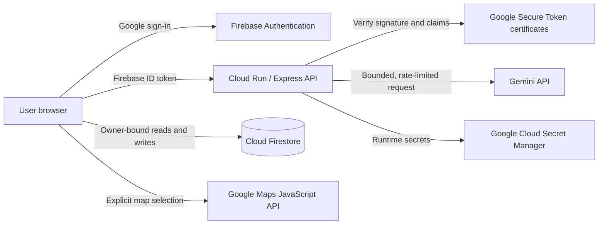

# Reflective — Gemini Journal Companion

Reflective is a privacy- and security-first AI journaling companion built for the Gen AI Academy APAC Ideathon. It helps people explore emotions, identify patterns, and turn difficult moments into manageable next steps through multi-turn conversations with Gemini.

> Reflective supports journaling, emotional reflection, and help-seeking. It is not a therapist, medical device, diagnostic tool, emergency service, or substitute for professional care.

## Live project

- **Public app:** [reflective-journal-ai-companion.ai.studio](https://reflective-journal-ai-companion.ai.studio/)
- **Cloud Run endpoint:** [reflective-gemini-journal-companion-516107960247.us-west1.run.app](https://reflective-gemini-journal-companion-516107960247.us-west1.run.app/)
- **Gen AI Academy APAC Ideathon:** Submitted on 2026-09-06（Asia/Taipei）
- **Product demo:** [LinkedIn post](https://lnkd.in/p/g2PDpeEi)
- **Source:** [github.com/NNBtw/reflective-gemini-journal](https://github.com/NNBtw/reflective-gemini-journal)

The public app, Cloud Run endpoint, social demo, and repository were each verified from a signed-out browser context before submission. The demo uses synthetic journal content and an isolated Google demo account.

## Beyond the starter project

This implementation began with Google's [Cloud Run AI Challenge codelab](https://codelabs.developers.google.com/codelabs/cloud-run/cloud-run-ai-challenge?hl=en) and was substantially extended into a deployable product. Original engineering work includes:

- Firebase ID-token verification at the Cloud Run API boundary, not only a signed-in frontend.
- Owner-isolated Firestore paths with strict document, nested-field, and message-transition validation.
- A persistence boundary that saves the user's message before Gemini generation and never reports success when the final database write fails.
- Per-IP and per-user rate limits, bounded prompts, safe error mapping, and retryable-only model fallback.
- Structured reflection summaries and takeaways with defensive parsing and persistence.
- Deterministic crisis-support routing instead of asking Gemini to improvise high-risk guidance.
- Consent-based Google Maps pinning without automatic device geolocation or sending coordinates to Gemini.
- English and Traditional Chinese UI localization stored locally in the browser without changing Gemini's response language.
- Search, moods, tags, responsive layouts, and portable Markdown export.
- Firestore Emulator, security, location, and production-build verification plus a documented remediation process.

## Deployed capabilities

- Google sign-in through Firebase Authentication.
- Multi-turn reflective conversations powered primarily by `gemini-3.6-flash`, with the actual `modelUsed` retained with generated messages.
- Reflection modes for questions, summaries, brainstorming, action steps, and mindful grounding.
- Personal summaries and three-to-five bounded takeaways.
- User-isolated journal history in a named Cloud Firestore database.
- Mood and tag editing, journal search, and Markdown export.
- `en` and `zh-TW` static interface localization.
- Explicit location selection, save, reload, removal, and Google Maps opening.
- Deterministic crisis-support responses and user-selected safety-resource regions.

Privileged RBAC administration and external notification delivery exist in the repository as locally tested candidate code, but they are **not claimed as deployed Production capabilities**. Voice input/output and additional locales remain deferred.

## Architecture



The browser reads and writes journals directly under:

```text
/users/{firebaseUid}/entries/{entryId}
```

Firestore Security Rules require the authenticated UID to match the path and validate the complete stored shape. Gemini calls go through Cloud Run; the Gemini API key is never sent to the browser. The Maps browser key is returned only to an authenticated location picker and is separately restricted for its intended web origin and API.

## Security and privacy design

### Authentication and API boundary

- The frontend sends a Firebase ID token in `Authorization: Bearer` for protected API routes.
- The backend verifies the JWT algorithm, key ID, signature, issuer, audience, expiry, issue time, and subject.
- Missing or invalid credentials fail before a Gemini request.
- API responses use fixed public error codes rather than returning provider or credential details.

### Abuse and cost controls

- Pre-authentication IP limit: 60 API requests per 10 minutes.
- Authenticated Gemini limit: 20 requests per user per hour.
- Conversations are limited to 20 messages and 16,000 total characters.
- Each message, title, tag, summary, and model response has an explicit bound.
- Model fallback continues only for temporary `429` or selected `5xx` responses.

The current limiter is process memory. A multi-instance production rollout should move counters to a shared store and consider Cloud Armor.

### Firestore isolation and integrity

- Users can access only their own entry and preference subcollections.
- Entry IDs, owner IDs, and creation timestamps are immutable.
- Message history can remain unchanged, append one validated message, or roll a full 20-message window forward by one.
- Bulk history replacement, shortening, oversized content, invalid locations, and unknown fields are denied.
- Server-only audit and notification collections reject all client access.

### Location privacy

- Reflective never calls browser/device geolocation.
- Coordinates are stored only after an explicit map selection and save action.
- Stored location data is limited to latitude, longitude, and an optional bounded label.
- Location metadata is not included in Gemini chat or summary payloads.
- Removing a pin removes it from later Markdown exports.

### Mental-health safety boundary

When the newest message contains configured high-risk self-harm language, the backend returns a deterministic support response before any Gemini call. This is a limited safety net, not a clinical assessment: indirect language may be missed and false positives are possible.

### App Check posture

The frontend initializes Firebase App Check with a domain-restricted reCAPTCHA Enterprise key. Cloud Firestore enforcement remains **Monitoring / Unenforced** while legitimate browser compatibility is evaluated. This is a documented residual risk, not a completed enforcement claim.

## Technology

- React 19, TypeScript, Vite, and Tailwind CSS
- Express on Google Cloud Run
- Gemini API through `@google/genai`
- Firebase Authentication
- Cloud Firestore with owner-bound Security Rules
- Firebase App Check with reCAPTCHA Enterprise
- Google Maps JavaScript API
- Google Cloud Secret Manager

## Local development

### Prerequisites

- A current Node.js runtime and `pnpm`
- A Firebase project with Google Authentication and Firestore enabled
- A Gemini API key
- Java 21 when running the Firestore Emulator suite
- Optional Google Maps JavaScript API key and Map ID for location-picker testing

### Install and configure

```bash
pnpm install
```

Copy `.env.example` to `.env.local`, replace every placeholder you intend to use, and set at minimum:

```dotenv
GEMINI_API_KEY=your_server_side_gemini_key
FIREBASE_PROJECT_ID=your_firebase_project_id
APP_URL=http://localhost:3000
```

For a separate Firebase project, also replace the public web-app identifiers in `firebase-applet-config.json` and set its `firestoreDatabaseId`. Firebase web configuration identifies the client project; it is not a substitute for Firestore Rules, API restrictions, or App Check.

Optional location configuration:

```dotenv
GOOGLE_MAPS_API_KEY=your_restricted_maps_browser_key
GOOGLE_MAPS_MAP_ID=your_map_id
```

Never commit `.env.local`, service-account credentials, OAuth secrets, webhook URLs, refresh tokens, or unrestricted server keys.

### Run

```bash
pnpm run dev
```

The local server listens on `http://localhost:3000` by default.

## Verification

```bash
pnpm run lint
pnpm run build
pnpm run test:location
pnpm run test:security
pnpm run test:rules
```

Latest verified release evidence:

The local baseline was rerun on 2026-09-06 after the documentation-only restructure；no application source or cloud resource changed.

| Gate | Result |
|---|---|
| TypeScript | Passed |
| Production client/server build | Passed; existing non-blocking large-chunk advisory |
| Location tests | `5/5` passed |
| Security tests | `13/13` passed |
| Firestore Emulator Rules tests | `31/31` passed |
| Preview first-message save, Gemini response, and reload persistence | Passed |
| Production page load and demo-account sign-in | Passed without visible error during submission-day smoke test |
| Production first-message save, Gemini response, and reload persistence | Passed; English input received an English Gemini response |
| Production Firestore permission error | None observed |
| Production model metadata | `modelUsed = gemini-3.6-flash` |
| Production Maps consent lifecycle | Load, explicit pin, save, reload, open in Google Maps, remove, and second reload Passed; no automatic device-location request or Maps/API error |

The browser-based Preview and Production checks were user-operated. Detailed evidence and earlier failed cases are retained in the project logs.

## Deployment

### 1. Deploy Firestore Rules

`firebase.json` targets the named database configured for this project. For your own deployment, update the database ID first, then run:

```bash
pnpm exec firebase deploy --only firestore --project YOUR_PROJECT_ID --config firebase.json
```

### 2. Build the application

```bash
pnpm run lint
pnpm run build
```

### 3. Configure runtime secrets

Create server-side secrets for `GEMINI_API_KEY` and, when Maps is enabled, `GOOGLE_MAPS_API_KEY` and `GOOGLE_MAPS_MAP_ID`. Grant the Cloud Run runtime identity access only to the secrets it needs.

### 4. Deploy to Cloud Run

The repository builds a static Vite client and `dist/server.cjs`; `npm start` launches the Express server. A representative source deployment is:

```bash
gcloud run deploy YOUR_SERVICE_NAME \
  --source . \
  --region YOUR_REGION \
  --allow-unauthenticated \
  --labels dev-tutorial=cloud-run-ai-challenge \
  --set-env-vars FIREBASE_PROJECT_ID=YOUR_PROJECT_ID,APP_URL=YOUR_PUBLIC_URL \
  --set-secrets GEMINI_API_KEY=GEMINI_API_KEY:latest
```

Add Maps secrets only when the browser key has the correct website and API restrictions. Configure Firebase authorized domains and App Check separately for the final hostname. Do not enable App Check enforcement until real-browser metrics support it.

## Known limitations

- App Check enforcement is intentionally deferred while monitoring browser compatibility.
- The Firebase web key has an API allowlist, but browser application restrictions remain deferred until all required origins are tested.
- Rate limits are per Cloud Run process rather than shared across instances.
- Crisis detection is deterministic and keyword-based, not a clinical classifier.
- Google Maps labels follow the browser and Google Maps localization defaults; the Reflective UI selector does not force the map language.
- The UI locale is browser/profile/origin-specific `localStorage` and does not roam with the Firebase account.
- Expired-session UI behavior has not received the same manual negative-path coverage as missing and malformed tokens.
- Privileged RBAC operations and external notifications are repository candidates, not verified Production features.
- Voice input/output and additional interface locales are deferred.

## Project records

- [`development-change-log.md`](development-change-log.md) — chronological feature, code, test, deployment, and tooling record.
- [`security-remediation-log.md`](security-remediation-log.md) — security findings, remediation evidence, and residual risks.
- [`PROJECT_STATE.md`](PROJECT_STATE.md) — concise current handoff state, blockers, and next actions.
- [`CONTEXT.md`](CONTEXT.md) — dated architecture map, file responsibilities, invariants, and collaboration boundaries.
- Git commits and pull requests — authoritative source-change history.

## Attribution

The project began as an Ideathon learning exercise based on Google's Cloud Run AI Challenge codelab. The product concept, reflective workflow, Firebase isolation, authenticated backend boundary, persistence handling, safety design, Maps privacy model, localization, responsive remediation, tests, and security documentation are project-specific extensions.

Google Maps content and interface behavior remain subject to Google Maps Platform terms. No third-party code, cloud credentials, or real journal content is intentionally included in this repository.
